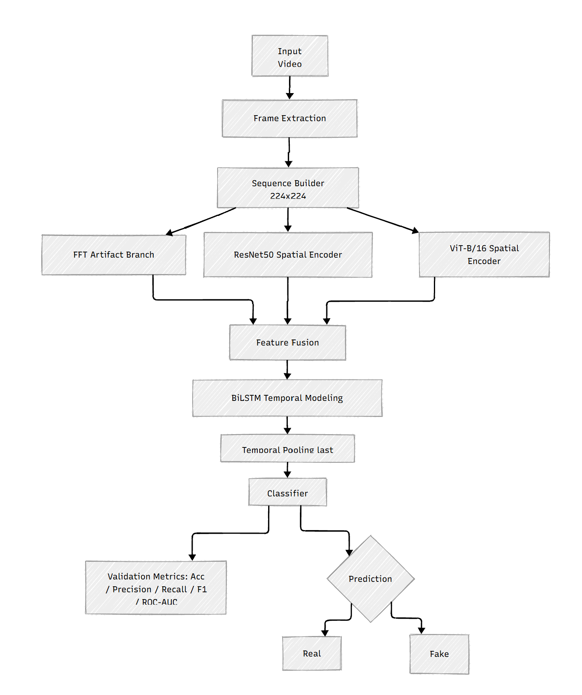
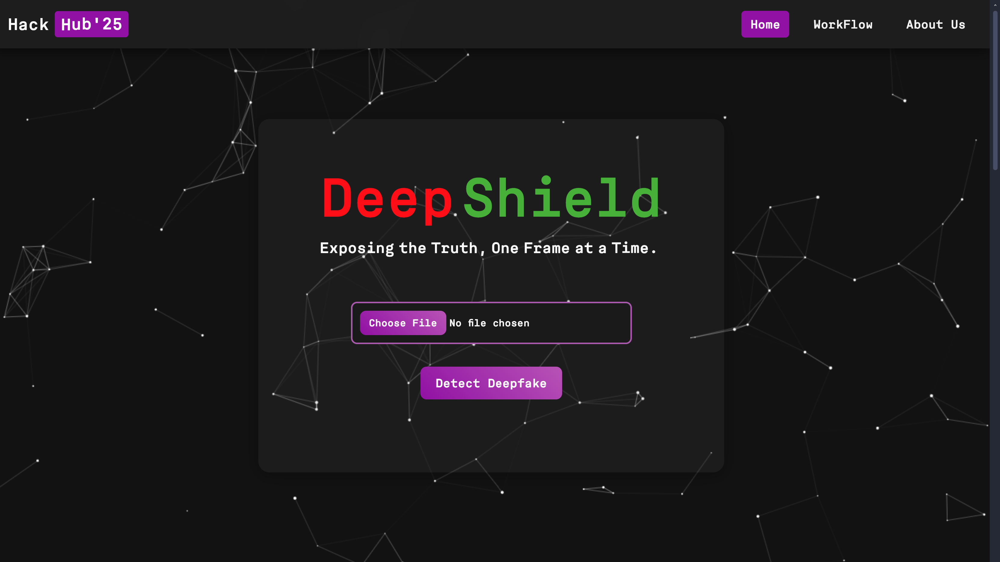
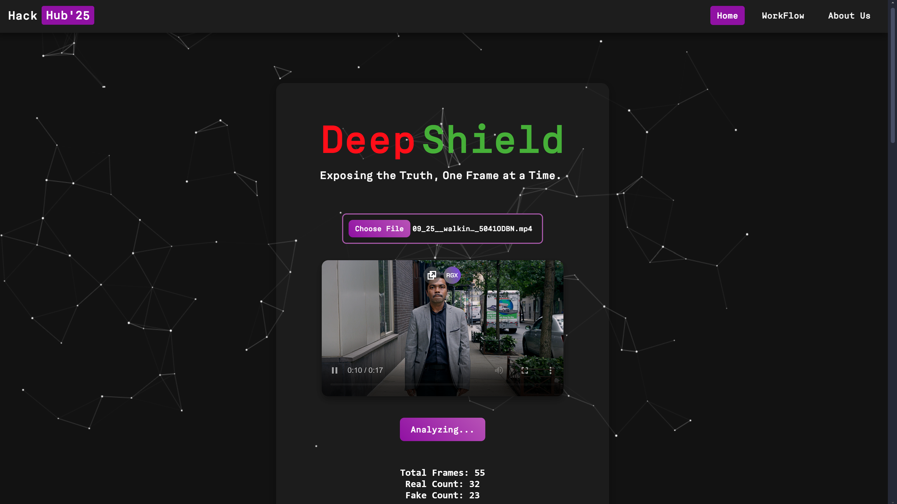
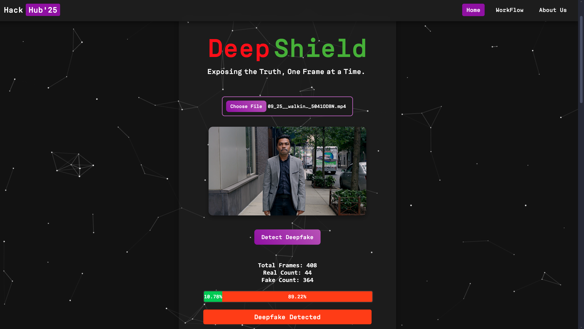

<body>

<h1>DeepShield: Deepfake Video Detection using a CNN+ViT+FFT+BiLSTM Hybrid</h1>

This project includes two model tracks: a deployment-ready ViT frame classifier used by the Flask backend, and a newer video-level hybrid notebook that adds CNN + ViT spatial features, FFT frequency cues, and temporal LSTM modeling.

<h2>Table of Contents</h2>
<ul>
    <li>Dataset Preparation</li>
    <li>Model Architecture</li>
    <li>Latest Model Updates</li>
    <li>Training Process</li>
    <li>Validation and Metrics</li>
    <li>Video Prediction</li>
    <li>Installation and Setup</li>
    <li>Results</li>
    <li>Website Usage</li>
</ul>

<h2>Dataset Preparation</h2>
<h3>Current Working Dataset Layout:</h3>
<ul>
    <li><strong>Frame Dataset Used by Training:</strong> <code>data/FF_frames/fake</code> and <code>data/FF_frames/real</code></li>
    <li><strong>Source Video Collections (optional/reference):</strong> <code>data/FF++</code> style real/manipulated folders</li>
</ul>

<h3>Frame Extraction:</h3>

Extract frames at approximately 1 FPS. Frame filenames should preserve video identity and frame order (for sequence modeling), e.g. <code>video123_00045.jpg</code>.

<h2>Model Architecture Flowchart</h2>

<h3>Model Variants</h3>
<ul>
    <li><strong>Backend Inference Model (current production path):</strong> ViT (<code>vit_base_patch16_224</code>), frame-level inference</li>
    <li><strong>Latest Notebook Model:</strong> ResNet50 + ViT + FFT branch + BiLSTM (video-level sequence classification)</li>
    <li><strong>Input:</strong> 224x224 frame tensors, grouped into temporal windows (default sequence length = 8)</li>
    <li><strong>Classes:</strong> 2 (folder-sorted class order, typically <code>fake</code>, <code>real</code>)</li>
    <li><strong>Pretrained Weights:</strong> Yes (ImageNet for spatial backbones)</li>
</ul>

<h3>Baseline ViT Initialization (backend-compatible):</h3>
<pre><code>model = timm.create_model('vit_base_patch16_224', pretrained=True, num_classes=2)
model.to(device)
model = nn.DataParallel(model)</code></pre>

<h3>Latest Hybrid Initialization (notebook):</h3>
<pre><code>model = TemporalHybridModel(
    num_classes=2,
    fft_dim=128,
    lstm_hidden=192,
    freeze_backbones=True,
    temporal_pool="mean",
).to(device)</code></pre>

<h2>Latest Model Updates</h2>
<ul>
    <li><strong>Video-level split:</strong> Train/validation split is done at video identity level to reduce frame leakage.</li>
    <li><strong>Sequence sampling:</strong> Sliding windows over ordered frames (<code>SEQ_LEN</code>, <code>SEQ_STRIDE</code>).</li>
    <li><strong>Frequency branch:</strong> FFT magnitude features are extracted per frame and fused with spatial features.</li>
    <li><strong>Temporal modeling:</strong> BiLSTM over per-frame fused embeddings with configurable pooling.</li>
    <li><strong>Stability controls:</strong> class-weighted loss, label smoothing, gradient clipping, LR plateau scheduler, and early stopping.</li>
    <li><strong>Checkpoint policy:</strong> final metrics are computed from the best validation checkpoint, not just last epoch.</li>
</ul>

<h2>Training Process</h2>
<h3>Baseline ViT Transformations:</h3>
<pre><code>transform = transforms.Compose([
    transforms.Resize((224, 224)),
    transforms.RandomHorizontalFlip(),
    transforms.ColorJitter(brightness=0.2),
    transforms.ToTensor(),
    transforms.Normalize(mean=[0.485, 0.456, 0.406], std=[0.229, 0.224, 0.225])
])</code></pre>

<h3>Baseline ViT Training Loop:</h3>
<pre><code>for epoch in range(num_epochs):
    model.train()
    for images, labels in train_loader:
        images, labels = images.to(device), labels.to(device)
        optimizer.zero_grad()
        outputs = model(images)
        loss = criterion(outputs, labels)
        loss.backward()
        optimizer.step()</code></pre>

    <h3>Latest Hybrid Training Pipeline (notebook):</h3>
    <pre><code># 1) build video records -> split by video -> create sequence samples
    # 2) train TemporalHybridModel (ResNet50 + ViT + FFT + BiLSTM)
    # 3) optimize with AdamW + ReduceLROnPlateau + early stopping
    # 4) save best checkpoint by val accuracy (tie-break by val loss)</code></pre>

<h2>Validation and Metrics</h2>
<h3>Classification Report:</h3>
    <pre><code>print(classification_report(labels_all, preds_all, target_names=class_names, zero_division=0))</code></pre>

<h3>Confusion Matrix:</h3>
<pre><code>sns.heatmap(cm, annot=True, cmap='Blues')
plt.xlabel('Predicted')
plt.ylabel('Actual')
plt.show()</code></pre>

    
Latest evaluation cells also report label distribution, prediction distribution, weighted precision/recall/F1, and ROC-AUC (binary mode).

<h2>Video Prediction</h2>
    
The Flask backend currently serves frame-level inference using the ViT checkpoint in <code>backend/models/best_vit_model.pth</code> and streams running real/fake percentages to the frontend.

<pre><code>def predict_video(video_path, model, transform, device):
    cap = cv2.VideoCapture(video_path)
    real_count, manipulated_count = 0, 0
    while cap.isOpened():
        ret, frame = cap.read()
        if not ret:
            break
        image = transform(Image.fromarray(cv2.cvtColor(frame, cv2.COLOR_BGR2RGB))).unsqueeze(0).to(device)
        with torch.no_grad():
            outputs = model(image)
            _, predicted = torch.max(outputs, 1)
        real_count += (predicted.item() == 0)
        manipulated_count += (predicted.item() == 1)
    cap.release()</code></pre>

<h2>Installation and Setup</h2>
<h3>Frontend (React):</h3>
<pre><code>cd DeepShield
npm install
npm start</code></pre>

<h3>Backend (Flask):</h3>
<pre><code>cd backend
pip install -r requirements.txt
python app.py</code></pre>

<h3>Model Files:</h3>

Place your trained model file at <code>backend/models/best_vit_model.pth</code>

Latest hybrid experiment notebook: <code>notebooks/frac_df_cnnvit_fft_temporal.ipynb</code>

Hybrid training checkpoint (default filename): <code>small_cnn_vit_fft_lstm_model.pth</code>

<h3>CUDA Verification:</h3>
<pre><code>python -c "import torch; print('CUDA Available:', torch.cuda.is_available())"</code></pre>

<h2>Results</h2>
<h3>Baseline ViT (frame-level):</h3>
<ul>
    <li>Training Accuracy: ~89.71%</li>
    <li>Validation Accuracy: ~87.77%</li>
</ul>

<h3>Latest Hybrid (video-level, experimental):</h3>
<ul>
    <li>Architecture and training flow are updated in the notebook with temporal + FFT fusion.</li>
    <li>Current runs are under active tuning; use notebook metric cells for the latest measured accuracy/F1.</li>
</ul>

<h2>Website Usage</h2>

<h2>Contributors</h2>

        

        <h3>Rohit N</h3>
        
Email: <a href="mailto:rohit84.official@gmail.com">rohit84.official@gmail.com</a>

        
LinkedIn: <a href="https://www.linkedin.com/in/rohit-n-1b0984280" target="_blank">Profile</a>

    

    

        <h3>Rahul B</h3>
        
Email: <a href="mailto:rahulbalachandar24@gmail.com">rahulbalachandar24@gmail.com</a>

        
LinkedIn: <a href="https://www.linkedin.com/in/rahul-balachandar-a9436a293" target="_blank">Profile</a>

    

    

        <h3>Yadeesh T</h3>
        
Email: <a href="mailto:yadeesh005@gmail.com">yadeesh005@gmail.com</a>

        
LinkedIn: <a href="https://www.linkedin.com/in/yadeesh-t-259640288" target="_blank">Profile</a>

    

    

        <h3>Gokul Ram K</h3>
        
Email: <a href="mailto:gokul.ram.kannan210905@gmail.com">gokul.ram.kannan210905@gmail.com</a>

        
LinkedIn: <a href="https://www.linkedin.com/in/gokul-ram-k-277a6a308" target="_blank">Profile</a>

    

</body>
</html>
